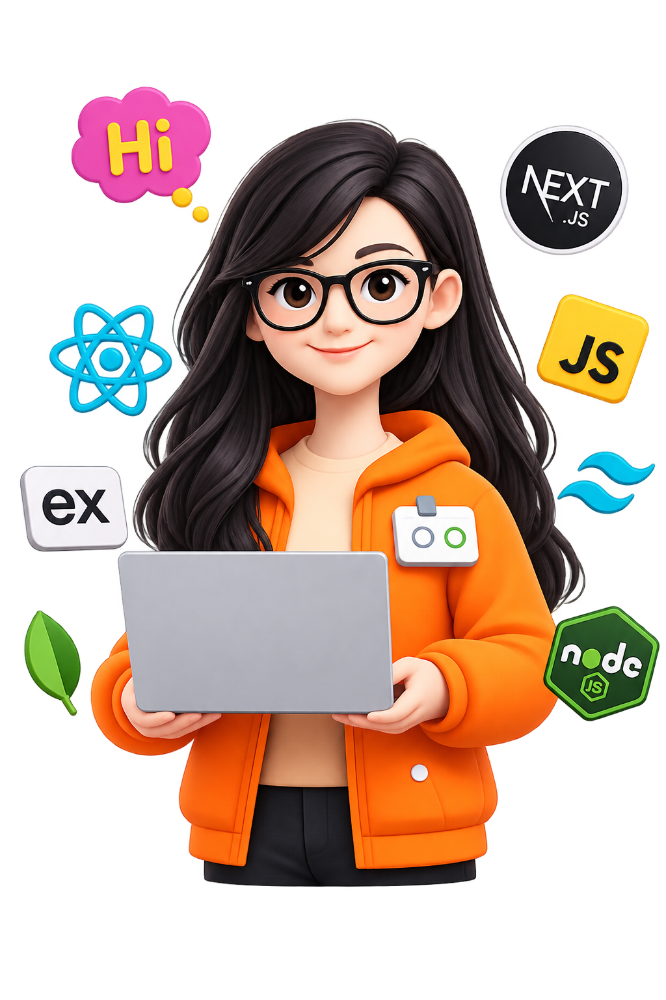
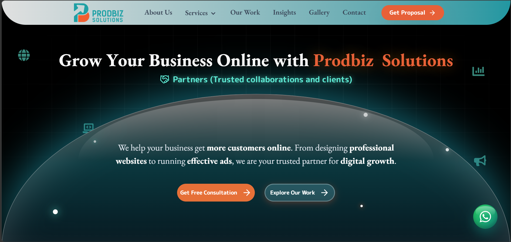

<div align="center">
  
</div>

<h3 align="center">
  Building scalable web applications | Creating reusable UI systems | Designing REST APIs
</h3>

<p align="center">
  <a href="https://github.com/moraakshaya">
    
  </a>
</p>

---

## 👩‍💻 About Me



I'm a **Frontend / Full-Stack Developer** specializing in React.js, JavaScript, Node.js and REST APIs. Currently open to software development opportunities.

- 🔭 **Currently Building:** Data-driven interfaces, Admin Dashboards, and Modern Landing Pages.
- 🌱 **Currently Learning:** `Node.js`, `Express.js`, `REST API Architecture`, `MongoDB`, and `API Security`.
- 🧠 **Development Philosophy:** *Build it clean. Make it useful. Keep improving.* I focus on writing code that is clean, reusable, responsive, maintainable, and scalable.
- 💬 **Ask me about:** React, JavaScript, Responsive Design, and Frontend Performance.

<br clear="both"/>

---

## 🛠 Tech Stack

<div align="center">
  
  &nbsp;&nbsp;&nbsp;&nbsp;
  
  &nbsp;&nbsp;&nbsp;&nbsp;
  
  &nbsp;&nbsp;&nbsp;&nbsp;
  
  &nbsp;&nbsp;&nbsp;&nbsp;
  
  &nbsp;&nbsp;&nbsp;&nbsp;
  
  <br /><br />
  
  &nbsp;&nbsp;&nbsp;&nbsp;
  
  &nbsp;&nbsp;&nbsp;&nbsp;
  
  &nbsp;&nbsp;&nbsp;&nbsp;
  
  &nbsp;&nbsp;&nbsp;&nbsp;
  
</div>

---

## 🚀 Featured Projects

<table>
  <tr>
    <td width="50%" valign="top">
      <div align="center">
        
      </div>
      <h3 align="center">💼 Lead–Client Management System</h3>
      <p>A full-stack CRM application designed to manage clients, leads, follow-ups, notes, and activities through a unified dashboard.</p>
      <b>Key Features</b>
      <ul>
        <li>📊 Interactive dashboard & analytics</li>
        <li>👥 Client & lead management</li>
        <li>📝 Follow-ups, notes & activity tracking</li>
        <li>🔐 JWT authentication & role-based access</li>
        <li>⚡ REST API architecture</li>
        <li>📱 Responsive UI</li>
      </ul>
      <p><b>Tech Stack:</b> React • Node.js • Express.js • MongoDB • Mongoose</p>
      <br/>
      <div align="center">
        <a href="#" target="_blank">
          
        </a>
        <a href="#" target="_blank">
          
        </a>
      </div>
    </td>
    <td width="50%" valign="top">
      <div align="center">
        
      </div>
      <h3 align="center">🔧 ChatFlow — Backend / In Progress</h3>
      <p>Real-Time Communication Platform.</p>
      <b>Progress</b>
      <ul>
        <li>Developed the backend architecture for a multi-tenant real-time communication platform.</li>
        <li>Implemented organization and authentication modules with JWT-based authentication and authorization.</li>
        <li>Designed REST APIs for organizations, users, workspaces, conversations, conversation members, and messages.</li>
        <li>Implemented modular backend architecture using Express.js, controllers, routes, middleware, and Mongoose models.</li>
        <li>Integrated Socket.IO architecture for real-time messaging and communication features.</li>
        <li>Implemented backend functionality for messaging features including conversations, members, messages, reactions, read receipts, and notifications.</li>
        <li>Tested and validated backend APIs using Postman.</li>
        <li>🚧 <b>Currently developing the React frontend for the platform.</b></li>
      </ul>
      <p><b>Tech Stack:</b> Node.js • Express.js • MongoDB • Socket.IO • Redis</p>
      <br/>
      <div align="center">
        <a href="#" target="_blank">
          
        </a>
      </div>
    </td>
  </tr>
</table>

---

## 💼 Professional Projects

<table>
  <tr>
    <td width="50%" valign="top">
      <div align="center">
        
      </div>
      <h3 align="center">🌐 Prodbiz Solutions — Company Website</h3>
      <p>A professional business website developed as part of my work at the company, focused on presenting the company's services, solutions, and brand through a modern responsive web experience.</p>
      <b>My Contribution</b>
      <ul>
        <li>🎨 Developed responsive website interfaces</li>
        <li>🧩 Implemented reusable UI components</li>
        <li>📱 Built mobile, tablet & desktop layouts</li>
        <li>⚡ Added interactive elements and animations</li>
        <li>🎯 Focused on clean UI, usability, and responsive design</li>
        <li>🚀 Contributed to the complete frontend development</li>
      </ul>
      <p><b>Tech Stack:</b> HTML • CSS • JavaScript • Tailwind CSS • GSAP</p>
      <br/>
      <div align="center">
        <a href="#" target="_blank">
          
        </a>
      </div>
    </td>
    <td width="50%" valign="top">
      <div align="center">
        
      </div>
      <h3 align="center">🌐 GVR — Website Development</h3>
      <p>A complete website developed independently during my professional experience. I was responsible for the <b>design implementation, frontend development, responsive layouts, interactions, and overall website development</b>.</p>
      <b>My Contribution</b>
      <ul>
        <li>🎨 Designed and developed the website interface</li>
        <li>💻 Built responsive layouts for desktop, tablet & mobile</li>
        <li>🧩 Developed reusable UI components</li>
        <li>⚡ Implemented animations and interactive elements</li>
        <li>📱 Optimized the experience across different screen sizes</li>
        <li>🚀 Handled the complete frontend development independently</li>
      </ul>
      <p><b>Tech Stack:</b> HTML • CSS • JavaScript • Tailwind CSS • GSAP</p>
      <br/>
      <div align="center">
        <a href="#" target="_blank">
          
        </a>
      </div>
    </td>
  </tr>
</table>

---


## 🎯 2026 Goals Journey

```diff
+ [✓] Strengthen React Development & Build Real-world Applications
+ [✓] Work with REST APIs, Node.js & MongoDB
- [ ] Build production-ready backend systems
- [ ] Improve system architecture skills
- [ ] Contribute to open source
- [ ] Grow as a Full Stack Developer
```

---

## 🤝 Let's Connect

I'm currently seeking **Full Stack / Frontend Developer roles**. Whether you have a question about my work or want to discuss a potential opportunity, my inbox is always open!

<div align="center">
  <a href="https://linkedin.com/in/moraakshaya">
    
  </a>
  &nbsp;&nbsp;
  <a href="mailto:your.email@example.com">
    
  </a>
  &nbsp;&nbsp;
  <a href="#">
    
  </a>
</div>

<p align="center">
  <br/>
  <b><code>console.log("Let's build something great 🚀");</code></b>
</p>
